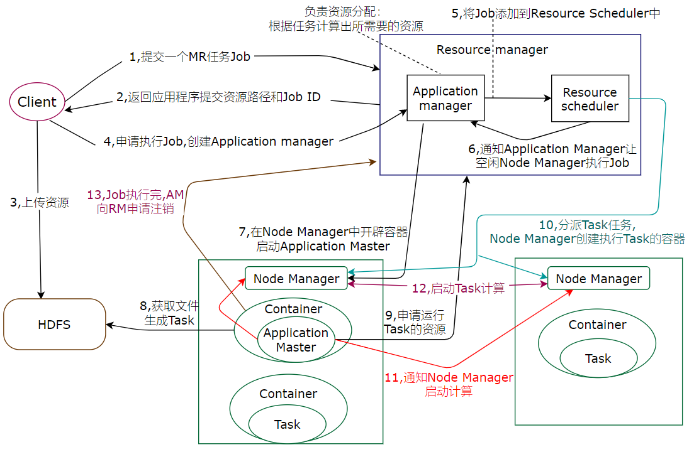
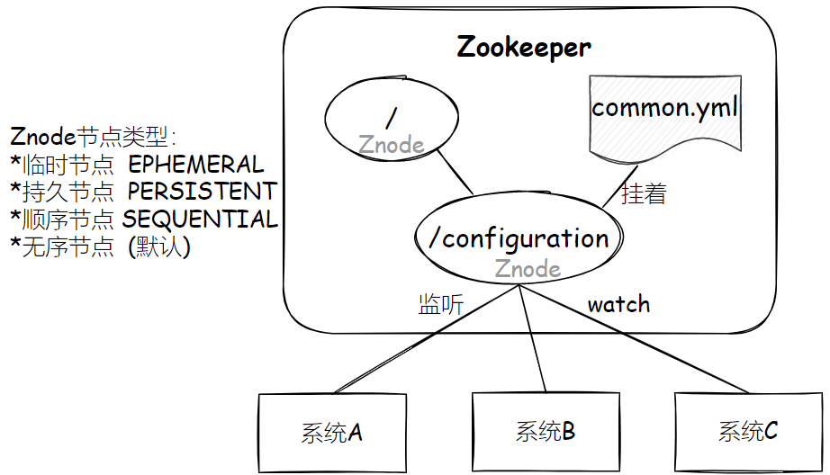
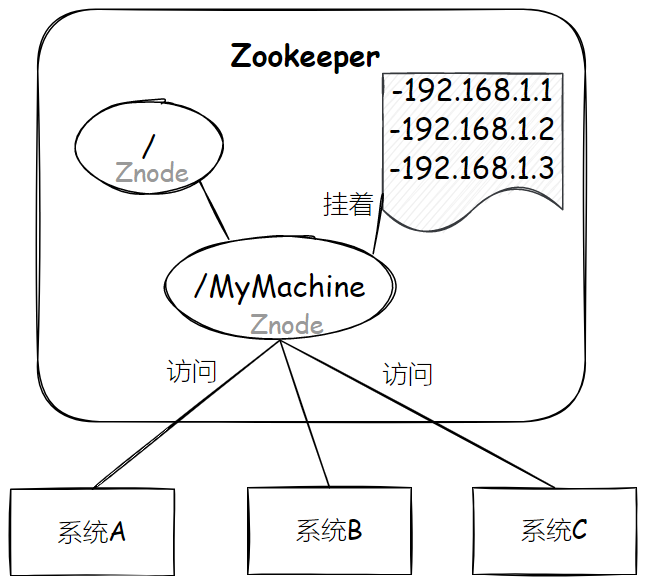
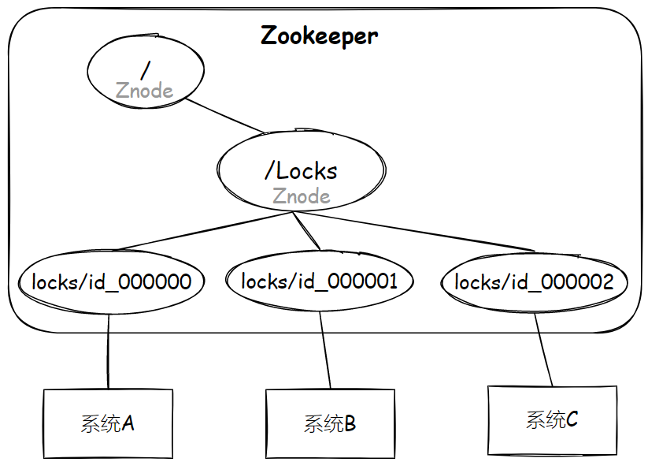
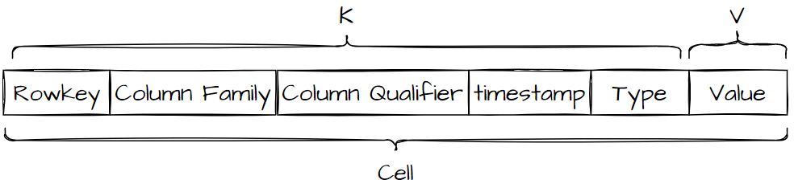
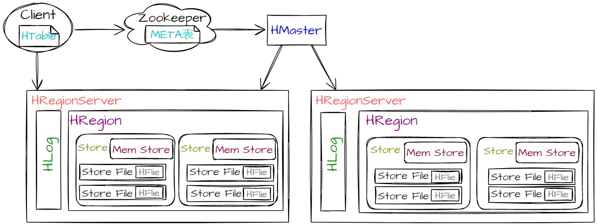
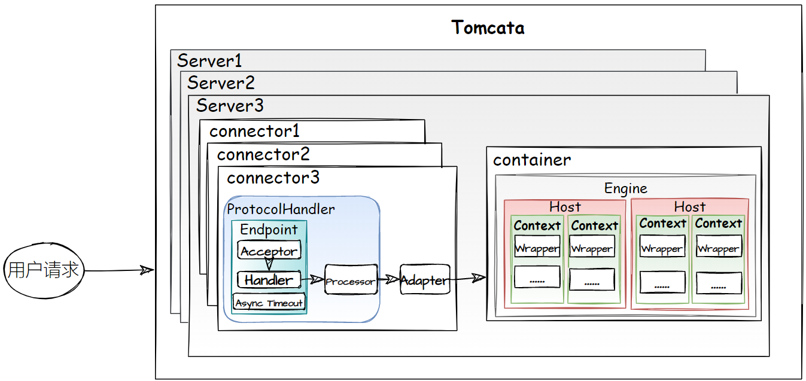

# HDFS
[HDFS读写流程](https://www.jianshu.com/p/b730862aa213)

# MapReduce
[MapReduce流程图](https://zhuanlan.zhihu.com/p/388553083)
> **input**
> 文件存储在HDFS中，切块Block(128M)，默认3个备份存储在多个节点中
> MR通过`Inputformat`，读取数据从HDFS

> **Splitting**
> 读取后切片Split，Split的数量由Block决定
> split大小由minSize、maxSize、blockSize决定

> **Mapper**
> Map个数由Split决定，一个Split分配一个MapTask
> Map()函数处理数据，会输出一组key/value对，编写MR程序的Map函数，现在使用Hive SQL代替MR

Map之后，数据进入`分区方法`，标记好分区，发送给`环形缓冲区`(128M buffer in memory)，溢写前对数据`排序`(key索引:字典排序:快速排序)，达到80%，进行`溢写`，溢写文件`排序`(归并排序)，按照分区存储到磁盘。

> **Shuffle**
> 不需要编写但关键
> Shuffle将相同key/value对组合在一起(Combiner阶段)，传给Reduce主机

每个Reduce拉取Map对应分区数据，数据存到内存，内存不够存到磁盘。将内存和磁盘数据都`归并排序`，可对数据分组操作。整个Shuffle三次排序。

>**Reduce**
>Reduce()函数处理key/value，合并相同key的value值，产生另外的key/value对，输入到HDFS。

# Yarn
核心思想：ResourceManager和ApplicationMaster将整个功能分开



# Hive
FaceBook为解决海量数据的统计分析，基于Hadoop开发的数据分析工具。
**Hive没有存储能力，只有使用数据的能力。**
> 将结构化数据文件映射成数据库表。
> Hive是数仓工具，数据从HDFS获得，不能直接数据访问HDFS，通过MR实现。
> **本质：将HQL语句转换为MR任务，进行数据访问。**
> 根据业务编写SQl语句，自动地匹配Hive封装的MR，运行MR生成分析结果。

Hive中(元数据)Meradata:Hive表和数据的映射关系，有Hive创建的Database、table、分区、属性、表的数据所在目录等元数据。元数据存储在Derby或者第三方MySQL中。
**Hive元数据不断更新修改，HDFS文件多读少改，所以元数据不能存储在HDFS，只能存储在数据库中**
Metastore:元数据服务,Hive管理库表元数据。

# Zookeeper
Google的Chubby的，分布式应用程序协调服务。
`监听`：Znode节点的数据变化，子节点的增减变化
* `统一配置管理`：从系统A、B、C的配置中抽取其中相同的配置文件common.yml，即使改变不需重启。

* `统一命名服务`：为有一部分资源命名，通过名字访问资源。

* `分布式锁`：[Java锁？分布式锁？乐观锁？行锁？](https://mp.weixin.qq.com/s?__biz=MzI4Njg5MDA5NA==&mid=2247484989&idx=1&sn=7beaa0db8b29cc8758c7846fe04dfbd2&chksm=ebd7473cdca0ce2a7aea8e6e2a22a5c183b8be3f1cdc93f8d7c3842a560eb5668071cebe5e37&token=948022247&lang=zh_CN#rd)

```
判断自己是不是最小的节点
- 是，拿到锁
- - 执行完，删除节点，释放锁
- 否，监听比自己小的节点
```
* `集群管理`：Zookeeper动态选举Master，Znode节点类型是顺序临时节点，选举最小作为Master。挂机后Znode节点删除，新的最小作为Master。系统A挂机，A的节点删除，通过监听节点，系统B、C感知系统A挂机。

# HBase
HBase是Google BigTable的，面向列、稀疏、随机访问、实时读写、存储检索数据的NoSQL分布式数据库。*不是关系型，不支持SQL，数据分析能力弱*
> `数据结构:`
> * Table:表，由列族组成
> * Row Key:数据记录的唯一标识，按字典排序
> * Column Family:列族，同一列族存储在同一目录
> * Column Qualifier:列
> * Timestamp:时间戳/版本号
> * Cell:单元格

Column= Column Family:Column Qualifier
key   = rowkey,column,timestamp,type
Cell  = rowkey,column,timestamp,type,value




**写过程**
1. 客户端向RegionServer发送写请求，客户端先从缓存中定位Region，否则访问Zookeeper，从META表获取Region信息。
2. 访问的对应的RegionServer，把数据写入HLog(WAL)和MemStore。*WAL存储在HDFS中，通过WAL还原数据*
3. MemStore达到阈值--(flush)-->(HDFS)StoreFile,底层由HFile格式存储。*在Hlog文件中写一个标记，MemStore丢失，从HLog恢复*
4. 多个StoreFlie达到阈值--(compact合并)-->一个大的StoreFlie。*版本合并和数据删除*
   单个StoreFlie大小超过阈值--(split)-->把Region拆成两个。*HMaster分配到两个相应的RegionServer上*
**读过程**
1. 客户端访问Zookeeper，从META表获取Region信息(位置)
2. 向对应的RegionServer建立连接，发起读取数据请求。
3. RegionServer先到MemStore中查数据，否则就到BlockCache中查，最后到磁盘HFlie中查。

# Tomcat
免费、轻量的Web应用服务器。



| 组件 | 功能 |
| ---- | ---- |
| Service | 对外提供Web服务。 |
| Connector | 对外接收请求，监听端口，将请求处理后传递给容器，最后将结果反馈给外界。 |
| Container | 对内处理业务，用于股那里和调用Servlet相关逻辑。 |
| ProtocolHandler | 协议处理器，不同组合的封装。 |
| Endpoint | 端点，处理Socket接收和发送的逻辑。Accept监听请求，Handler处理数据，AsyncTimeout检查请求超时。 |
| Processor |处理器，构建Tomcat的Request和Response对象。 |
| Adapter | 适配器，实现Tomcat Request、Response与Servlet Request、Response的转换。 |
| Engine |引擎，管理多个虚拟主机。 |
| Host | 虚拟主机，部署Web应用。 |
| Context | Web应用，包含多个Servlet封装器。 |
| Wrapper | 封装器，对Servlet封装，创建实例，执行、销毁。 |

# Redis
C语言开发，内存数据库。读写效率极高，持久化、缓存、键值对(KV)、NoSQL数据库、单线程、I/O，支持多种数据类型。
**Redis持久化：**
* RDB：快照形式，直接把内存中数据保存到一个dump.rdb文件中。
* AOF：所有对Redis服务器进行修改的命令存到一个文件里。只追加不改写。

<kbd>会话缓存</kbd>
<kbd>消息队列</kbd>
<kbd>排行榜</kbd>
<kbd>发布订阅</kbd>
<kbd>商品评论</kbd>