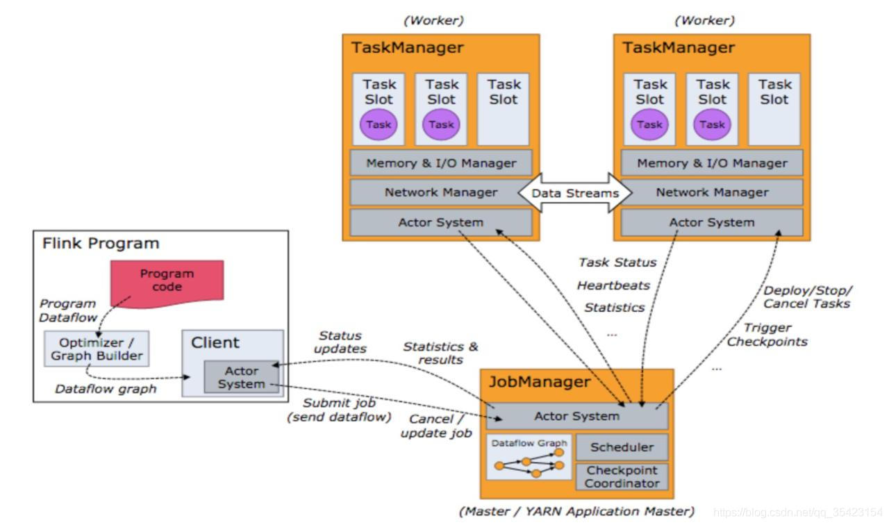

# What is Apache Flink?
[Apache Flink](https://flink.apache.org/flink-architecture.html)
Apache Flink is a framework and distributed processing engine for stateful computations over unbounded and bounded data streams. Flink has been designed to run in all common cluster environments, perform computations at in-memory speed and at any scale.

# Application scenarios
* 实时报表
* 广告投放
* 实施推荐
* 实时数据采集
* 信息推送
* 订单状态跟踪
* 实时结算
* 实时报警
* 风险检测

# Lambda架构
## 设计理念
Lambda架构的设计是为了在处理大规模数据时，同时发挥流处理和批处理的优势。通过批处理提供全面、准确的数据，通过流处理提供低延迟的数据，从而达到平衡延迟、吞吐量和容错性的目的。为了满足下游的即席查询，批处理和流处理的结果会进行合并。

## 组成
* Batch Layer：批处理层
* Speed Layer：加速处理层
* Serving Layer：服务层、合并层

# 系统架构

# Exactly-Once语义
发送到消息系统的消息只能被消费端处理且仅处理一次，Exactly-Once语义是消息系统和流式计算系统中消息流转的最理想状态，但是在业界并没有太多理想的实现。因为真正意义上的Exactly-Once依赖消息系统的服务端、消息系统的客户端和用户消费逻辑这三者状态的协调。例如，当您的消费端完成一条消息的消费处理后出现异常宕机，而消费端重启后由于消费的位点没有同步到消息系统的服务端，该消息有可能被重复消费。