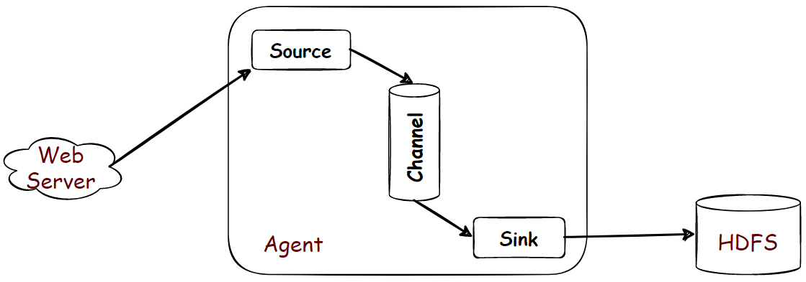
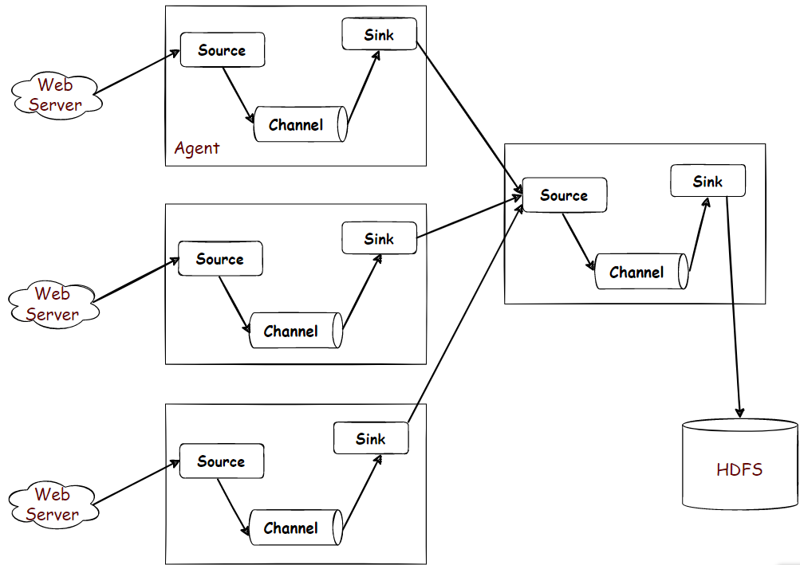
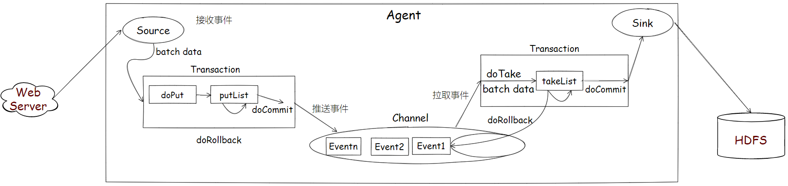

# 是什么？
高可用、高可靠、分布式的海量日志采集、聚合、传输系统。Flume基于流式架构，灵活简单，实时的动态采集。
能够采集多种形式源数据<u>文件、socket数据包、kafka</u>等，输出到<u>HDFS、HBase、Hive、kafka</u>等。

## 由`Flume OG`-->到`Flume NG`:

**Flume OG**:(核心组件设计不合理、代码工程臃肿、核心配置不标准，尤其是日志传输不稳定)
* agent(代理节点)：从数据源收集日志数据
* collector(收集节点)：集中收集的日志文件，存入HDFS
* master(主节点)：管理agent、collector的活动

**Flume NG**:(重构核心组件、核心配置、代码架构)
* 取消了Master、Zookeeper-->纯粹的传输工具
* agent(代理节点)：source + sink + Channel

## 组成架构

> Event:数据传输基本单位。Headers(Event属性) + Body(数据)
> **Agent**(核心):一个JVM(Java Virtual Machine)进程,获取数据，将数据封装成Event(事件)，输送到目的地。
> * Source:采集组件，跟数据源对接，获取数据。
> * Channel:传输通道，缓冲区[允许Source和Sink不同速率的运行]，能处理多个Source写入操作和sink读取操作。
> 自带两种Channel:
> * - Memory Channel:内存中的队列，适用于不关心数据丢失的情景。
> * - File Channel:写入磁盘中，程序关闭和机器宕机不会丢失数据。
> * Sink:下沉组件，向下一个agent传递数据 或者 传输到最终存储系统中。
> 不断轮询Channel中Event且批量移除。

# 做什么？
1. 复制
2. 多路复用
3. 负载均衡
4. 故障转移
5. 聚合
